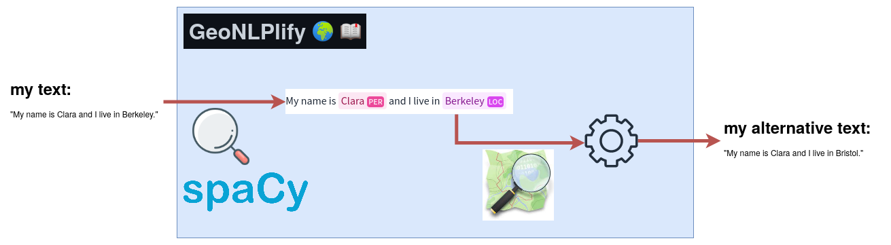

<h1 align="center"> GeoNLPlify
:earth_africa: :book:
</h1>

A NLP library for data augmentation focusing on spatial information contained in text.

<p align="center">
  
</p>


## Usage
```python
import geonlplify

my_text = "My name is Clara and I live in Berkeley."
geonlplify.geonlplify(my_text)
```
```bash
'My name is Clara and I live in Bristol'
```

## Installation
You can install GeoNLPlify in three ways: in a [virtual_env](#virtual-environment), in a [conda environment](#conda-environment), or using :construction: [pip](#pip-install)
### Virtual Environment
1. Git clone this repository
  ```bash
  git clone https://github.com/remydecoupes/GeoNLPlify.git
  ```
2. Create a virtual env
  ```bash
  python -m venv geonlplify_venv
  source geonlplify_venv/bin/activate
  pip install --upgrade pip
  ```
3. Install dependencies
  ```bash
  cd GeoNLPlify
  pip install -r virtual_env_requirements.txt
  ```

5. Donwload [world-cities from simple maps](https://simplemaps.com/data/world-cities)
  ```bash
  wget -qO- https://simplemaps.com/static/data/world-cities/basic/simplemaps_worldcities_basicv1.75.zip  | bsdtar -xvf- -C ./geonlplify/simplemaps/
  ```
### Conda environment
1. Git clone this repository
  ```bash
  git clone https://github.com/remydecoupes/GeoNLPlify.git
  ```
2. Create a conda with all the required dependencies
  ```bash
  cd GeoNLPlify
  conda env create -n geonlplify_conda --file conda_environment.yml
  ```
3. Install spacy models
  ```bash 
  python -m spacy download en_core_web_trf
  ```
4. Donwload [world-cities from simple maps](https://simplemaps.com/data/world-cities)
  ```bash
  wget -qO- https://simplemaps.com/static/data/world-cities/basic/simplemaps_worldcities_basicv1.75.zip  | bsdtar -xvf- -C ./geonlplify/simplemaps/
  ```
### Pip install
:construction: **Packaging in progress** :construction:

## Acknowledgement
:pray: This library use those terrific tools/libraries/data :muscle::
+ [Spacy](https://spacy.io/)
+ [The Komoot geocoder Photon](https://photon.komoot.io/)
+ [OpenStreeMap](https://www.openstreetmap.org/copyright)
+ [Simplemaps data](https://simplemaps.com/data/world-cities)